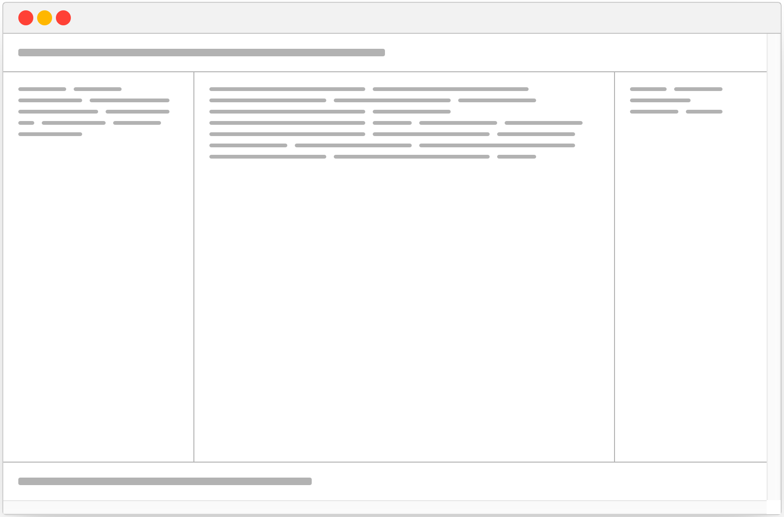

# CSS Layout: The Holy Grail

- Repository name: `holy-grail`
- Mode: `solo`
- Type of Challenge: `exercise`
- Duration: `1 day (or a little more)`

## Learning Objectives

By now you should know some HTML, and a little of CSS. You have worked with structuring content in a semantically correct way (using divs, paragraphs...), but CSS is so much more. A classic challenge of CSS is to visually organize the content on a page in a hierarchical way.

By the end of this challenge you will be able to:

- use **CSS flexbox** to place block-level elements beside each other
- use **CSS grid** to place block-level elements beside each other
- create a responsive layout using CSS only, and respecting a semantic HTML structure

## Your Mission

At the agency your boss came to you with a task: _you need to quickly create a prototype for the home page of a new client_. The structure should have a header spanning the whole width, a 3-column middle section, and a whole width footer. The wireframe they gave you looks like this:



This is conventionally called the **Holy Grail Layout**. Don't ask me why 🤷‍♂️

You decide to try out 2 different CSS techniques to build this page, so that you can choose the best one at the end of your work.

## 🌱 Must haves

1. Create your new repository, and add 3 HTML files called: `flexbox.html`, `grid.html`.
2. Make sure each of the two files uses the following HTML structure:

```html
<!DOCTYPE html>
<html lang="en">
  <head>
    <meta charset="UTF-8" />
    <meta name="viewport" content="width=device-width, initial-scale=1.0" />
    <title>CSS Layout - Holy Grail</title>
  </head>
  <body>
    <header>
      <!-- Place a title here -->
    </header>

    <nav>
      <!-- Place a list of links here -->
    </nav>

    <main>
      <!-- Place a long text here -->
    </main>

    <aside>
      <!-- Place a small image here -->
    </aside>

    <footer>
      <!-- Place a copyright notice here -->
    </footer>
  </body>
</html>
```

3. Create 2 CSS files called, you guessed it: `flexbox.css`, `grid.css`.
4. Make sure each HTML file includes the corresponding CSS file.
5. In each of the CSS files you will use one of the two different techniques. You will have to do some googling to figure out how to use **flexbox** and **grid** to create the Holy Grail layout.
6. Create a final file called `index.html`: this file will only contain the links to the other two files.
7. Make your work available online via Netlify.
8. Visit your pages online, change the size and look how smoothly everything adjusts. Now repeat a thousand times and feel good about yourself.

### Rules

1. Remember: one and only one technique per file
2. NO frameworks allowed 😏

### Responsiveness

Make it responsive. It should have **1 breakpoint** only, and it should behave like this:


## 🌼 Nice to haves (doable)

Some time left for a challenge?
Give the third technique a try!

- use **CSS floats** to place [block-level elements](https://developer.mozilla.org/en-US/docs/Web/HTML/Block-level_elements) beside each other (naming: `floats.html`)


## Good luck!

